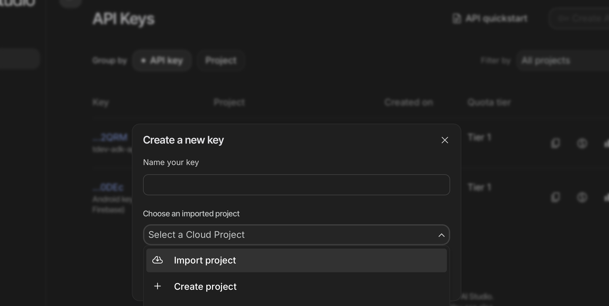
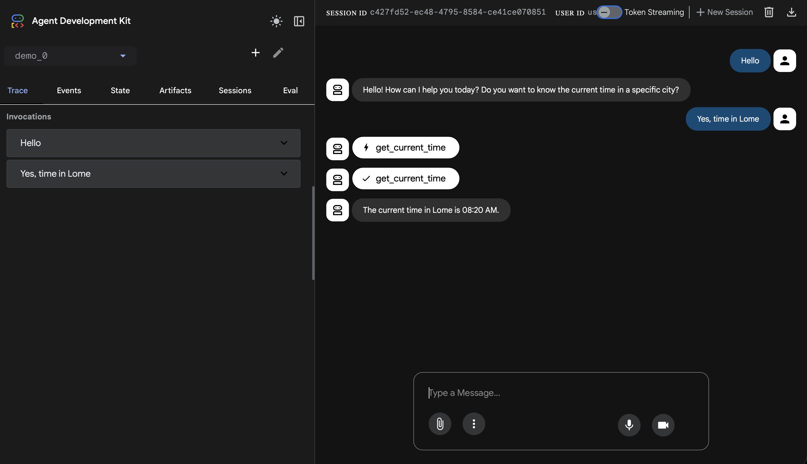

## 🛠️ Guide de Configuration de l'Environnement Python pour l'IA

Ce guide vous prépare à créer votre agent IA en Python, en assurant que tous les outils et dépendances sont correctement installés et configurés.

### Étape 1 : Installation de Python et Outils de Base

Installez **Python 3.10 ou supérieur**. `pip` (le gestionnaire de paquets) devrait s'installer avec Python.

  * **Windows :** Téléchargez l'installeur sur [python.org](https://www.python.org/downloads/). **Action Cruciale :** Cochez **"Add Python X.X to PATH"** pendant l'installation.
  * **macOS/Linux :** Utilisez la version système si elle est récente (`python3 --version`) ou installez-en une plus récente (via Homebrew, apt, etc.).

### Étape 2 : Récupération du Code Source

Utilisez `git` dans votre terminal pour récupérer le projet, puis naviguez dans le dossier.

1.  Ouvrez le **Terminal** ou l'**Invite de Commandes**.
2.  Clonez le dépôt :
    ```bash
    git clone https://github.com/CorneilleEdi/nufia_ai_africa_camp.git
    cd nufia_ai_africa_camp
    ```

### Étape 3 : Création et Activation de l'Environnement Virtuel (VENV)

Nous isolons les dépendances du projet pour éviter les conflits.

1.  **Créez** l'environnement virtuel (nommé `venv`) :
    ```bash
    python3 -m venv venv
    ```
2.  **Activez** `venv` (vous devez voir `(venv)` apparaître dans votre invite) :
    | OS | Commande |
    | :--- | :--- |
    | **Windows (CMD)** | `venv\Scripts\activate` |
    | **macOS / Linux** | `source venv/bin/activate` |

### Étape 4 : Installation des Librairies

Avec `venv` actif, installez toutes les dépendances listées dans `requirements.txt`.

```bash
pip install -r requirements.txt
```
Absolument. Préciser le lien direct vers la gestion des clés API rendra l'étape encore plus rapide pour vos étudiants.

J'ai mis à jour l'**Étape 5 : Configuration de l'Accès à l'API** dans la version du guide "un peu plus fournie" pour y inclure ce lien direct.

-----


### Étape 5 : Configuration de l'Accès à l'API

Votre agent a besoin d'une clé pour interagir avec les modèles Gemini.

1.  **Obtenez votre Clé :**

      * Rendez-vous directement sur la page de gestion des clés : **[https://aistudio.google.com/api-keys](https://aistudio.google.com/api-keys)**.
      * Cliquez sur le bouton **"Create API Key"**.
      * 
      * **Copiez votre clé** une fois générée.

2.  **Créez un fichier `.env` :** Dans **chaque dossier** où l'agent doit être exécuté, créez un fichier nommé exactement **`.env`**.

3.  **Ajoutez le contenu suivant**, en remplaçant l'espace réservé par votre clé :

    ```bash
    export GOOGLE_API_KEY="<VOTRE_CLÉ_API_ICI>"
    export GOOGLE_GENAI_USE_VERTEXAI=FALSE
    export GOOGLE_GENAI_MODEL="gemini-2.5-flash-lite"
    ```

---
### Étape 6 : Test Final

Vérifiez que tout se lance correctement.

1.  Assurez-vous que l'environnement **`(venv)`** est actif.
2.  Lancez le serveur web du projet :
    ```bash
    adk run web
    ```
3.  Ouvrez votre navigateur et accédez à **`http://localhost:8000`**. Si la page charge, vous êtes prêt pour le workshop \!

1.  Arrêtez le serveur avec **`Ctrl + C`**.
